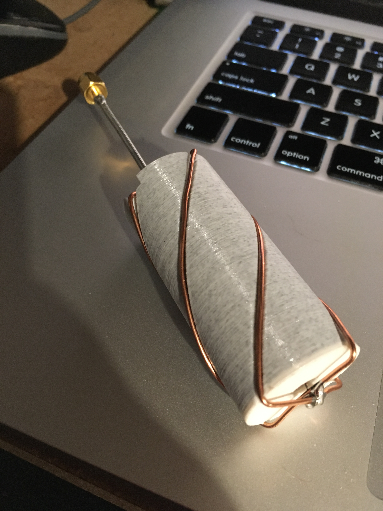

# qfh_antenna_mold_OpenSCAD

[OpenSCAD](https://www.openscad.org/) parametric model of a [QFH antenna](https://en.wikipedia.org/wiki/Helical_antenna) mold.

See "phyical settings" and "practical settings" banners for knobs to tweak. The dimensions are calculated using the same logic as [John Coppens' QFH antenna dimension calculator](http://jcoppens.com/ant/qfh/calc.en.php)

## Images

QFH antenna

2.45 GHz antenna in OpenSCAD GUI

L1 GPS (1575.42 MHz) in OpenSCAD GUI

Printed L1 GPS QFH antenna mold (from an older version of the .scad file)

L1 GPS QFH antenna using the previously-pictured mold (from an older version of the .scad file)
